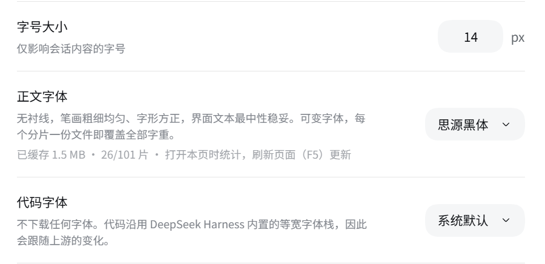

# @guowenzhang/dsh-ui-beautify

English | [中文](README.zh.md)

## Background: DeepSeek Harness

DeepSeek Harness (`dsh`) is the open-source agent harness from DeepSeek AI, where nearly every capability is a plugin on [Cordis](https://github.com/cordiverse/cordis). It is in **developer preview** and iterating fast, so expect compatibility-breaking changes ([docs](https://deepseek-harness.github.io/deepseek-harness/), `0.1.7-alpha.*`); this plugin is a standalone third-party package that resolves `@deepseek-ai/*` from the running host.

## The problem this plugin solves

The Web GUI body and code fonts were whatever the system fell back to and could not be changed; this plugin adds one font picker row for each under **设置 → 通用设置** and downloads a face on first use.

## Screenshots


设置 → 通用设置: the **正文字体** and **代码字体** rows sit directly under **字号大小**, each showing the selected face's description and its cache status.

## Install

```sh
npx @deepseek-ai/dsh plugin --profile web add @guowenzhang/dsh-ui-beautify
```

From the npm registry: <https://www.npmjs.com/package/@guowenzhang/dsh-ui-beautify> — restart the host afterwards; local checkouts, git sources and troubleshooting are in [AGENTS.md](AGENTS.md).

## Usage

### Pick a body font

**Settings → 通用设置**, under **字号大小**: the **正文字体** row. Open the pill on the right and choose a face; the page restyles on selection with no confirmation step, and the choice is written to the current profile's settings file.

### Pick a code font

The **代码字体** row, one line below the body font and above the work-process display. It defaults to `system`, so a fresh install changes nothing about how code looks until you choose otherwise.

### Understand what `system` means

`system` removes the plugin's stylesheet links and token override, returning the tokens to `ui-theme`'s own declaration. It is not a frozen copy of today's defaults — upstream default-font changes are followed. Selecting it is also the only way to switch custom fonts off; uninstalling is not required.

### Read the cache status line

Each row shows a title, the selected face's description, and a status line such as `已缓存 103 KB · 1/101 片`. There is no download button: fonts are pulled on demand as the page needs them. The counter is a progress read-out of on-demand downloading, not a failure — it rises as you browse and new characters appear. The numbers are read when the row renders and about 1.5 seconds after a font switch, not in real time; the status line therefore keeps a standing hint that refreshing the page (F5) re-counts.

### Understand the download behavior

Downloads happen per shard, not as a whole package. A selected face's stylesheet is fetched first, then only the shards the page's characters actually need. Concurrent requests for the same file are coalesced, and later page loads read from local disk without touching the network.

| Situation | What you see |
|---|---|
| The host machine has no outbound network | Downloads fail; the GUI keeps rendering with its fallback fonts |
| The browser has network access but the host does not | Downloads still fail — the browser never contacts an external site |

## Notes and caveats

- **The host machine must reach the network for a font's first use.** The browser only talks to the DSH origin; the host does the fetching. This is the one place the plugin depends on host connectivity, and it is the only reason a first use can fail while the browser itself is online.
- **`system` is the code font's default**, so a fresh install is visually a no-op until you pick something.
- **`maple-mono-cn` is the only code font that covers Chinese.** The other four cover Latin only and fall back to the built-in stack for CJK; `maple-mono-cn` is also 9 MB and reaches the machine through jsDelivr because the npm mirror does not carry that package.
- **A missing font never breaks the interface.** Text renders first with the fallback font and swaps in when the shard arrives; if the download fails for good, the fallback simply stays.
- **Two places ignore the font tokens** because they hardcode their own font: the integrated terminal (an xterm constructor argument, not CSS) and a hardcoded `Inter` prefix in the queue panel's stylesheet.
- **The mirror list and cache directory are host-start configuration**, not live settings — changing them requires restarting the host.
- **Fonts are not covered by this plugin's license.** Each font keeps its own; see [LICENSE](LICENSE) and [NOTICE](NOTICE).

## License

The plugin itself is Apache-2.0 — see [LICENSE](LICENSE) and [NOTICE](NOTICE).

**The plugin distributes no font file.** Fonts are downloaded on demand from npm mirrors into a local cache and keep their original licenses. Noto Sans SC, Noto Serif SC, ZCOOL XiaoWei, ZCOOL KuaiLe, ZCOOL QingKe HuangYou, Ma Shan Zheng, Zhi Mang Xing, Long Cang, Liu Jian Mao Cao, Inter, Geist, JetBrains Mono, Fira Code, Geist Mono, Noto Sans Mono and Maple Mono CN are SIL Open Font License 1.1, packaged by Fontsource or by the font's own publisher. LXGW WenKai, LXGW WenKai TC and LXGW WenKai Screen are SIL Open Font License 1.1; the npm packages carrying them — `lxgw-wenkai-webfont`, `lxgw-wenkai-tc-webfont` and `lxgw-wenkai-screen-webfont` — are MIT.

## Further reading

- [AGENTS.md](AGENTS.md) — the full font catalogue, the download pipeline, the cache layout, developer commands, the add-a-font procedure, and troubleshooting.
- [dsh-web-design](https://github.com/zhang-guo-wen/dsh-web-design) — a sibling plugin that previews and edits HTML in the DSH Sidebar.
- [DeepSeek Harness documentation](https://deepseek-harness.github.io/deepseek-harness/).
